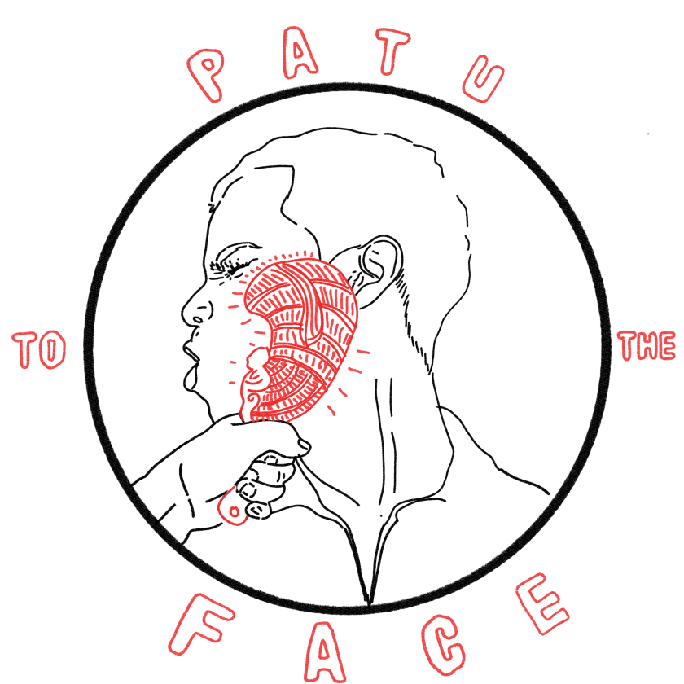

   
       | <a href="{{ item.url }}" alt="{{ item.title }}">{{ item.title }}</a> | 
   

> I was just talking about 3000 year old Welsh skulls and Māori not being tangata whenua and bam,  patu right in my face.  Had to stop, and go down to the A&E

Noel – a Historian (no really, you can just say you’re a historian and the Herald will print any drivel you make up)

> We were performing our ‘Haka’ to advertise insurance, when someone came running up, and screamed ‘Ana tō kai, kai toa’ and hit the head of marketing in the face with some sort of club thing.

Spokesperson for ARAG insurance

> I don’t know what happened, one minute I was saying “muesli bars have too much sugar in them for growing bodies” and the next minute, tewhatewha upside the head. Well I never!

Judgey McJudgerson – Kindy parent/teacher

> Look as the enlightened feminist I am I was just commenting on how ‘ethnic’ women are more attractive if they don’t look ‘ethnic’. Then crack, taiaha to the temple. I said don’t hit me I love women and what about fat yoga… and then pow, wahaika in the waha.

Someone whose core is super soft

> He’s just three …

The “journalist” couldn’t finish this statement as he was promptly hit 16 times with a mere

> Some one started an email to me with Kia ora, so I was typing out a reply saying “I’m not Māori please address me in English”. As I was about to hit send a felt an immense pain at the back of my head and someone yelled “English that, cracker”

Perhaps the most fragile person in the world

> I was just saying that white women are women of colour too when a blinding pain exploded in the back of my head. As I fell to the ground I saw someone holding a pouwhenua and they yelled "so what colour is that? ".

A racist politician dog whistling the white supremacists. 

> I was driving north to my bach for the long weekend. I mean, it's a long weekend and I'm rich enough to own a bach, so of course rules don't apply to me. I was coming round the corner and suddenly a huata flew into my tyre, I lost control of my overpowered suv and came to a screeching halt on the side of the road. Just as I was getting out to check I heard someone yelling "stay at home means stay at home you cracker" 

Some rich prick 

> I was writing an op ed about how the NZ response can be explained by the fact that they are an island nation. But suddenly I felt the pain of of a kotiate hitting the back of my head. Each blow was accompanied by a word "you're... a... smaller... island... with... the... wealth... of... 300...years... of... empire... and... you... still... fucked... it... up" 

Some English dickhead 
